## Создание сервиса геообработки ArcGIS Server с конфигурационным файлом в формате json

Способ реализации сервисов с конфигурационными файлами имеет следующие плюсы:
-при переносе сервиса ArcGIS Server из среды в среду;
-при публикации на множество серверов одного сервиса;
-если ваша организация практикует автоматическое развёртывание.

p<>.Из минусов - в теории "прикручивание" обязательной io-операции по считыванию json с диска замедляет сервис - но на практике эти миллисекунды не замечаются.

Ход работы (кратко):
1. Создать скрипт геообработки.
2. Вынести переменные в JSON-файл.
3. Создать service-definition сервиса геообработки с копированием конфигурационного файла.
4. Опубликовать сервис геообработки на сервере.
5. Изменить параметры сервиса внутри файла JSON.
6. Использовать.


В скрипте примере будем складывать 3 целых числа - 2 из конфигурационного
файла и одно из входных параметров:

```python
from json import load
from arcpy import GetParametr, SetParameter

config = r"D:\project\test\config.json"


def config_vars(json_file):
	with open (json_file) as json_data:
		config_dict = load (json_data)
		for i in config_dict:
			globals()[i] = config_dict[i]


def main():
	long3 = GetParamter(0)
	config_vars(config)
	AddMessage(int(long1)+long2+long3)
	SetParameter(1, int(long1)+long2+long3)

if __name__ == "__main__":
	main()
```

p<>.Краткое описание: в начале импортируются необходимые модули (для парсинга json, для приёма и установки параметров arcpy). Затем указывается абсолютный путь к конфигурационному файлу в формате json. Далее объявляется функция, которая позволяет в теле скрипта обращаться к переменным как они прописаны в json (в json "long1" - в скрипте long1). В главной исполнительной функции main: осуществляем приём третьего числа из параметра (GetParamter), запускаем считывание конфигурационного файла (config_vars) и возвращаем результат (SetParameter). В конце скрипта - условие запуска.

Создаём toolbox-инструмент, указываем параметры (входной long и выходной long).

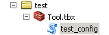

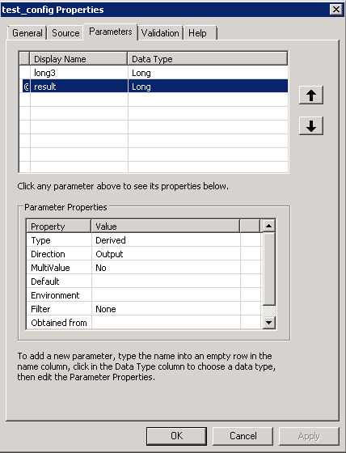

Создаём json-файл с переменными.

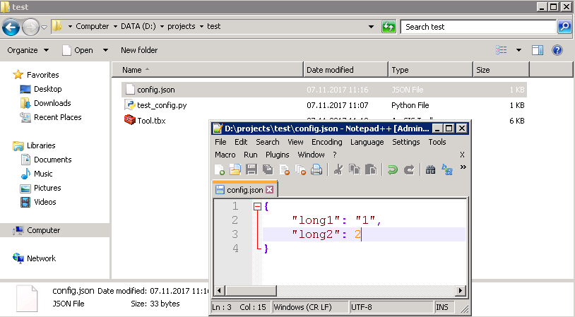

Запускаем инструмент в ArcMap.

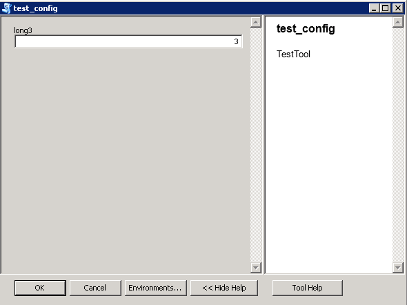

Видим результат.

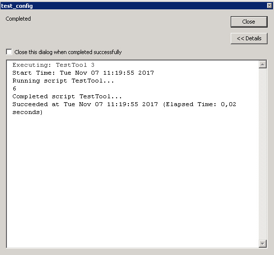

Создаём sd-файл созданной тестовой геообработки.

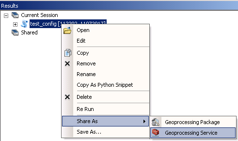

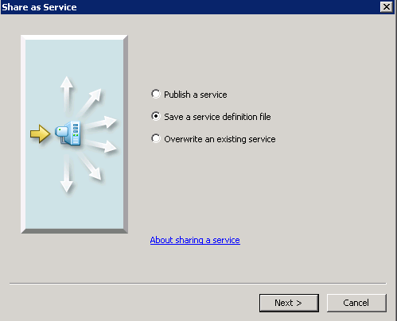

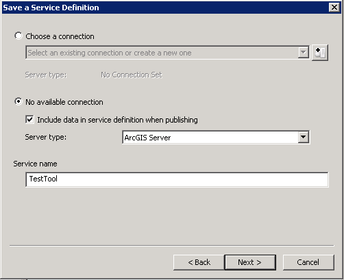

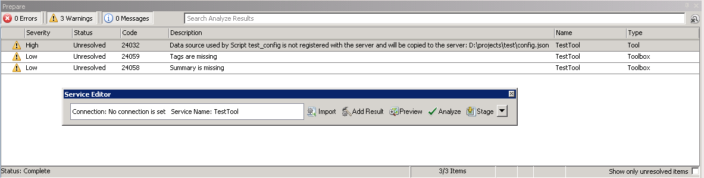

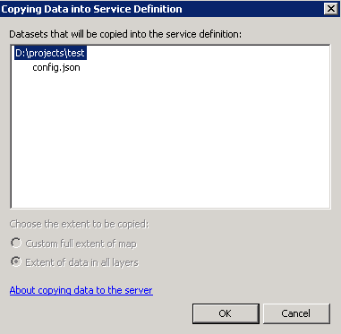

Опубликуем sd на ArcGIS Server и зайдём в папку сервиса, чтобы увидеть конфигурационный файл. В моём случае путь - C:\arcgisserver\directories\arcgissystem\arcgisinput\TestTool.GPServer\extracted\cd.

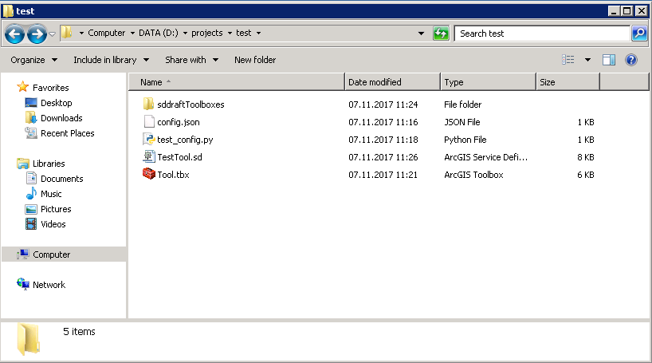

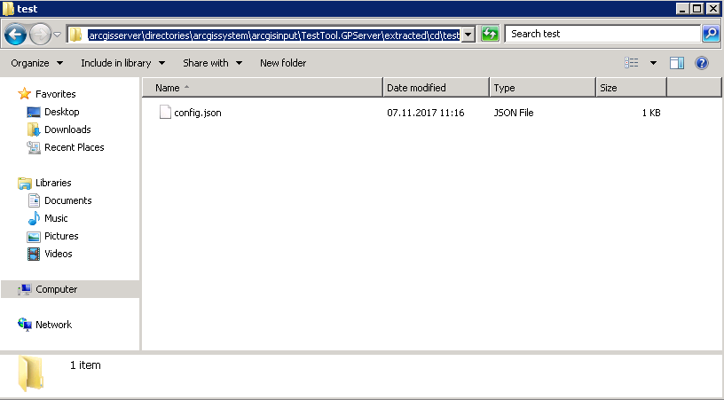

Откроем его и поменяем значения.

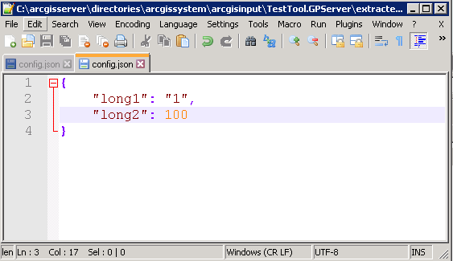

Протестируем сервис в браузере.

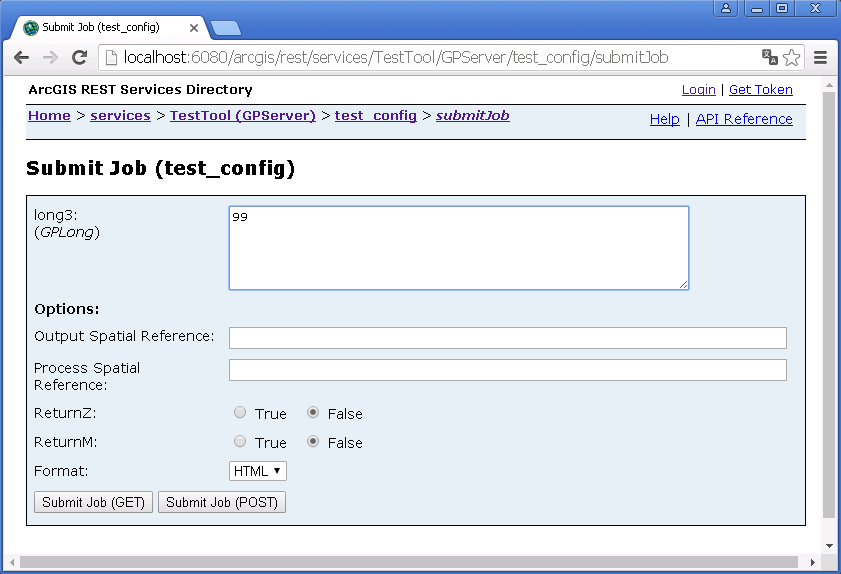

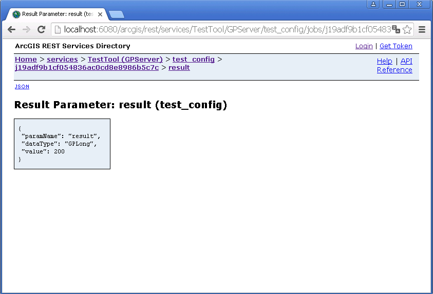


