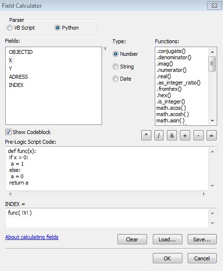
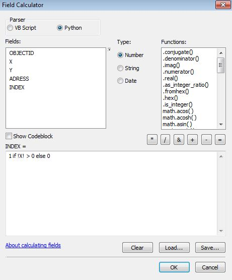
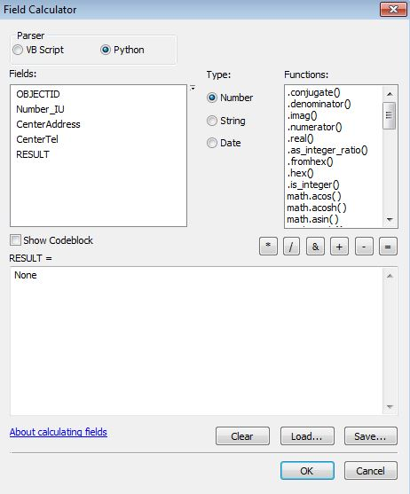

## Использование окна "Field Calculator"

Самым простым использованием Python в ArcGIS Desktop являются манипуляции с атрибутивными данными через окно "Field Calculator". Данные из ячеек строки могут извлекаться по названиям из столбцов (со специальным ограничителем - !Field1!, !X!) и назначаться аргументами функции.

### Пример с полной функцией



В приведённом примере используется следующая функция:

```python
def func(x):
 if x > 0:
  a = 1
 else:
  a = 0
 return a
```

При выполнении в поле "INDEX", будет рассчитано значение по указанной функции, которая в качестве аргумента принимает значение из поля "X" (в той же строке).

### Пример с анонимной функций

Если позволяет код, есть возможность отказываться от конструкции полноценной функций и использовать краткий синтаксис (т. н. lambda-функции).



```python
# 1 if !X! > 0 else 0
lambda x: 1 if x > 0 else 0
```
### Пример с обычным присвоением

Чтобы прописать ячейкам определённое значение достаточно его присвоить.



В данном примере проиллюстировано присвоение значения Null.
