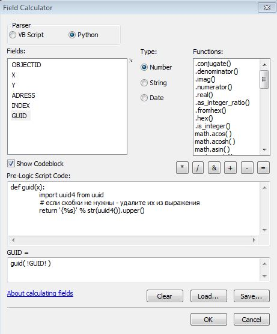

## Calculate Field - прописать GUID

Для генерации GUID можно воспользоваться встроенной библиотекой Python `uuid`. Для добавления скобок и пр. используем форматирование.

```python
def guid(x):
    import uuid4 from uuid
    # если скобки не нужны - удалите их из выражения
    return '{}'.format(str(uuid4()).upper())
```


