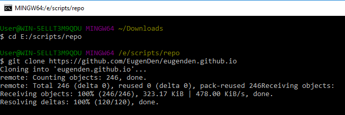
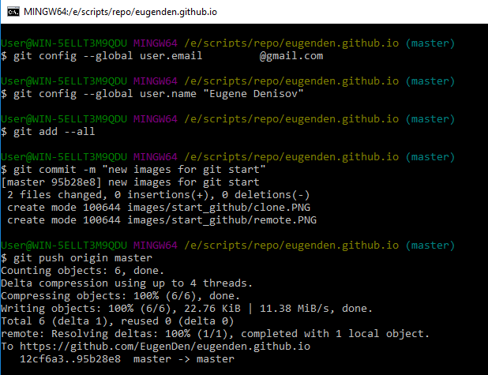

## Git. Старт на Windows

Первым делом скачаем Git c официального сайта (powershell):

```powershell
[Net.ServicePointManager]::SecurityProtocol =  [System.Security.Authentication.SslProtocols] "tls, tls11, tls12"
$url = "https://github.com/git-for-windows/git/releases/download/v2.17.1.windows.2/Git-2.17.1.2-64-bit.exe"
$output = "C:\Users\User\Downloads\Git-2.17.1.2-64-bit.exe"
$web_client = new-object System.Net.WebClient
$web_client.DownloadFile($url,$output)
```

После закачки начинаем установку:

```powershell
& "C:\Users\User\Downloads\Git-2.17.1.2-64-bit.exe"
```

Выбираем настройки под себя, установливаем и запускаем. 

Определимся с папкой, в которой будет размещаться репозиторий, перейдём в неё и склонируем репозиторий с github.
 


Далее перейдём в папку репозитория, проверим псевдонимы установленные по умолчанию.


Затем пройдём идентификацию, зафиксируем изменения (add), обзовём изменение (commit) и отправим на github (push). Консоль попросит ввести email/username и пароль.



Загрузим изменения, которые сделал другой пользователь (или сами же, но из веб-браузера)


