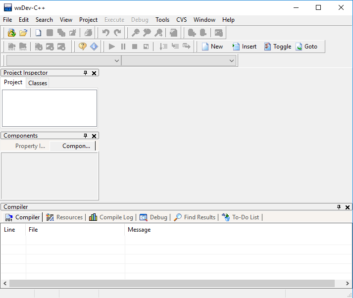
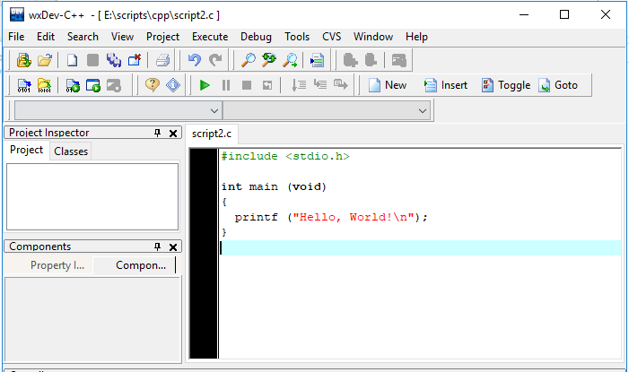
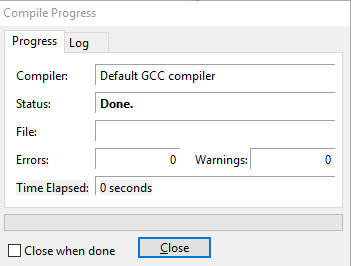
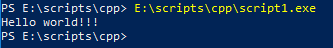

## Простой старт на windows

Скачиваем средство разработки wxDev-C++ с ресурса [http://wxdsgn.sourceforge.net/?q=node/4](http://wxdsgn.sourceforge.net/?q=node/4)

Устанавливаем, выбираем первоначальные настройки, запускаем.



Нажимаем Ctrl+N чтобы создать новый скрипт.

Набираем следующие команды:

```c
#include <stdio.h>

int main (void)
{
  printf ("Hello, World!\n");
}
```

Сохраняем скрипт на диск с расширением `.c`.



Нажимаем Ctrl+F9 чтобы скомпилировать программу.



Запустим полученный exe в консоле.


