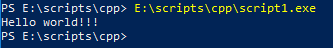

## Простой старт на windows

Скачиваем средство разработки wxDev-C++ с ресурса [http://wxdsgn.sourceforge.net/?q=node/4](http://wxdsgn.sourceforge.net/?q=node/4)

Устанавливаем, выбираем первоначальные настройки, запускаем.


Нажимаем Ctrl+N чтобы создать новый скрипт.

Набираем следующие команды:

```cpp
#include <iostream>
using namespace std;

int main ()
{
cout << "Hello world!!!\n";
return 0;
}
```

Сохраняем скрипт на диск.


Нажимаем Ctrl+F9 чтобы скомпилировать программу.


Запустим полученный exe в командной строке.


