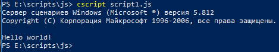
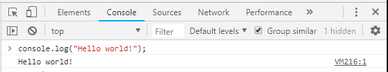
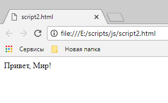

## Простой старт на windows

Для исполнения скриптов ECMAScript не нужно что-либо скачивать или компилировать. 

Чтобы запустить скрипт расширения JScript достаточно создать файл и запустить.

```js
WScript.Echo("Hello world!");
```

Сохранить с расширением `.js`.

Запускаем:




Чтобы запустить команду расширения JavaScript используем консоль браузера.

Откроем браузер и откроем консоль в отладчике (F12 в Google Chrome)

Набираем следующую команду и жмём Enter:

```js
console.log("Hello world!");
```



Другой вариант - встроим JavaScript в HTML-страницу (расширение `.html`). Создадим страницу следующего содержания:

```html
<!DOCTYPE HTML>
<html>

<head>
  
</head>

<body>

  <script type="text/javascript">
    document.write( 'Привет, Мир!' );
  </script>
  
</body>

</html>
```

Откроем в браузере:

