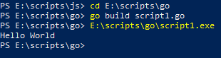

## Простой старт на windows

Скайчаем и установим инсталятор с официального сайта [https://golang.org/dl/](https://golang.org/dl/).

Создадим текстовый файл с расширением `.go`.

Введём следующие команды:

```go
package main

import "fmt"

func main() {
    fmt.Println("Hello World")
}
```

Далее в консоли перейдём в папку с файлом и запустим компиляцию командой `go build`. Затем запустим полученный `exe`.


