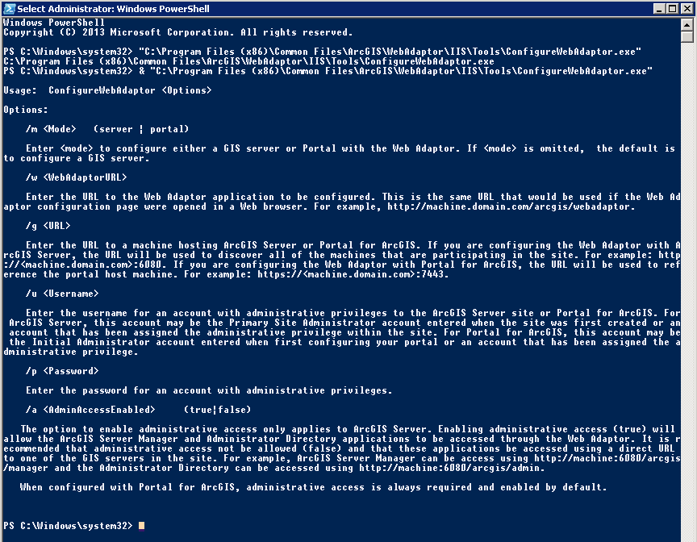

## Web-adapter (iis). Установка и удаление в консоли.

Адаптер должен быть распакован и файл Setup.exe доступен. Далее идём по справке:

[http://enterprise.arcgis.com/ru/web-adaptor/latest/install/iis/silently-install-arcgis-web-adaptor-portal.htm](http://enterprise.arcgis.com/ru/web-adaptor/latest/install/iis/silently-install-arcgis-web-adaptor-portal.htm)
[http://enterprise.arcgis.com/ru/web-adaptor/latest/install/iis/configure-arcgis-web-adaptor-portal.htm](http://enterprise.arcgis.com/ru/web-adaptor/latest/install/iis/configure-arcgis-web-adaptor-portal.htm)

Выполняем следующие команды в powershell, которые установят и настроят веб-адаптер.

```powershell
& "C:\Users\Sbt-arcgisdeva\Documents\ArcGIS 10.4.1\WebAdaptorIIS\Setup.exe" /qb VDIRNAME=eugen111 WEBSITE_ID=1 PORT=443
Start-Sleep -s 180
& "C:\Program Files (x86)\Common Files\ArcGIS\WebAdaptor\IIS\Tools\ConfigureWebAdaptor.exe" /m server /w https://localhost/eugen111/webadaptor /g https://my-ags-server:6443 /a true /u siteadmin /p 123456
```

Использовано название для адаптера - eugen111, порт https, сайт в IIS - по умолчанию.
Адаптер настроен на сервер по url https://my-ags-server:6443, c возможностью админского доступа через ссылку с веб-адаптером.

Опции ConfigureWebAdaptor можно посмотреть в консоли:



Сообщение о успешной установке:


Глянем в браузере:


Чтобы удалить веб-адаптер необходимо выполнить следующую команду (powershell):

```powershell
& msiexec /x '{F53FEE2B-54DD-4A6F-8545-6865F4FBF6DC}' /qn
Start-Sleep -s 60
```

Где {F53FEE2B-54DD-4A6F-8545-6865F4FBF6DC} код продукта в Windows. Справка предлагает набор идентификаторов для удаления:

[http://enterprise.arcgis.com/ru/web-adaptor/latest/install/iis/uninstall-arcgis-web-adaptor-portal.htm](http://enterprise.arcgis.com/ru/web-adaptor/latest/install/iis/uninstall-arcgis-web-adaptor-portal.htm)

Но можно определить коды установленных адаптеров командой (powershell):

```powershell
get-wmiobject -class Win32_Product | Where-Object -FilterScript {$_.Name -eq "ArcGIS 10.4.1 Web Adaptor (IIS)"}
```


+ доп. Приложение адаптера наследует физический путь сайта.
